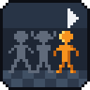
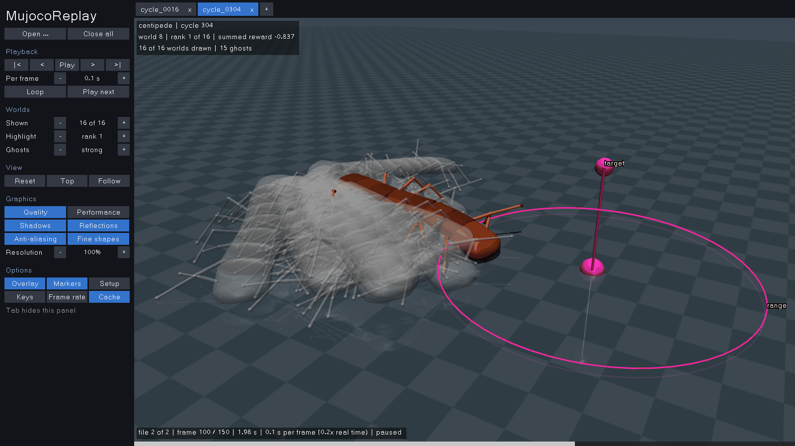
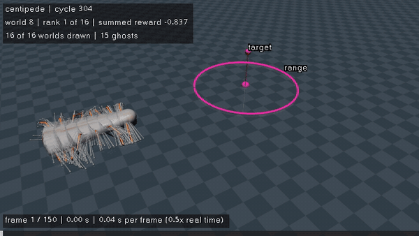
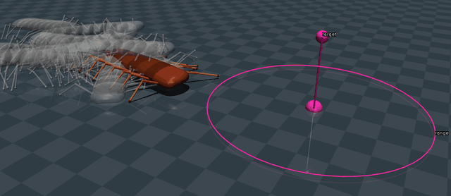
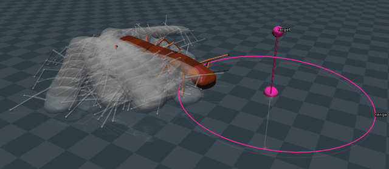

<p align="center">
  
</p>

<h1 align="center">MujocoReplay</h1>

<p align="center">
  Watch what your MuJoCo agents do while they train.<br>
  Replay recorded runs of any model, many worlds at once, as slowly as you like.
</p>



## What it does

Training only records positions. MujocoReplay draws them later, so watching
never slows the training down.

- **Any MuJoCo model.** A recording carries its own model: nothing to set up.
- **Many worlds in one scene.** The best world in its own colours, the others
  as grey ghosts, so the whole population shows at a glance.
- **Tabs.** Open several recordings and switch between them at the same
  frame, such as the start and the end of a training run.
- **Your pace.** Pause, step, slow down to seconds per frame, loop a file, or
  let it go on with the next tab by itself.
- **Videos.** The same scene, written to an MP4 file.

<p align="center">
  
  <br>
  <em>The Centipede model from the sibling project, in recordings simulated for these pictures.</em>
</p>

## Get it

### Windows: one program, nothing to install

1. Download **MujocoReplay-windows.zip** from the latest run of the
   [Windows executable](https://github.com/DrippingSoup22/MujocoReplay/actions/workflows/executable.yml)
   workflow: open the run, and the zip is under **Artifacts** (sign in to
   GitHub first).
2. Unzip it anywhere, and keep the folder whole.
3. Double-click **MujocoReplay.exe**.

The first time, Windows may say *Windows protected your PC*, since the
program is not signed: click **More info**, then **Run anyway**. On a laptop
with two graphics chips, add `MujocoReplay.exe` under Settings › System ›
Display › Graphics, and choose **High performance**.

### With Python: the command line and videos

The command line, and with it videos, needs Python 3.11 to 3.14. From a
clone of this repository:

```powershell
python -m pip install -e ".[video]"
mujoco-replay                                   # the window
mujoco-replay render run.npz --out replay.mp4   # a video
```

## Open recordings

Click **Open** (or press **O**) and pick one or more `.npz` files, or drop
them onto the window or onto the program. Each file opens in a tab of its
own, and switching tabs keeps the frame, so two runs compare moment by
moment:

| `cycle_0016` | `cycle_0304` |
| :---: | :---: |
|  |  |

## Keys

| Key | Does |
| --- | --- |
| **Space** | Play, pause |
| **← →** | Step back, step forward |
| **↑ ↓** | Faster, slower |
| **N**, **P** | Next, previous tab |
| **B**, double-click | Highlight another world, and look at it |
| Drag, right-drag, wheel | Rotate, pan, zoom |
| **F** | Follow the highlighted world (on at first), or stop |
| **V** | Reset the view |
| **L** | Loop the file |
| **Tab** | Hide the panel |
| **F1** | Every key |

The panel on the left holds the rest: how many worlds to draw, how strong
the ghosts are, the graphics (Quality or Performance), and what the overlay
shows. Settings are remembered between runs.

## Record your own runs

A recording is one `.npz` file with the model and every world's positions,
frame by frame. With the package installed, training code writes one in a
few lines:

```python
import mujoco
from mujoco_replay.recording import Recording, write_recording

model_xml = mujoco.MjSpec.from_file("model.xml").to_xml()  # the whole model
# qpos: every world's positions at every frame, shape (frames, worlds, nq)
write_recording("run.npz", Recording(model_xml, frame_seconds, qpos))
```

Scores, targets and other markers, events, and the run's settings are
optional; [docs/recording-format.md](docs/recording-format.md) lists them all.

## Status

**Stage R14, a camera that follows (2026-10-10):** the camera follows the
highlighted world from the start, since Centipede's worlds now walk on from
target to target, far from where they start; **F** switches it off, and the
choice is remembered. Videos follow each file's best world too.

**Stage R13, the Windows executable (2026-10-09):** one program that needs
no Python, which the user has run on Windows; GitHub builds it and checks it
on its own Windows machines at every push to `main`. Every stage, from the
recording format to the executable, is described in [plan.md](plan.md).

## Documentation

| Document | Describes |
| --- | --- |
| [plan.md](plan.md) | The stages that built the tool, each with its checks and results |
| [docs/recording-format.md](docs/recording-format.md) | The recording file: every key, its shape and meaning |
| [docs/design.md](docs/design.md) | How the tool works inside: the scene, playback, tabs, overlay, camera, graphics, panel, video, and the executable |
| [AGENTS.md](AGENTS.md) | Working rules for coding assistants |

<details>
<summary><b>More: development setup, the installed program, the tests, building the executable</b></summary>

### Development setup

The tool can share the Python environment of the sibling projects, or have
one of its own (`py -3.12 -m venv .venv`, then `.venv\Scripts\Activate.ps1`).
From this folder, in PowerShell:

```powershell
& "$HOME\.venvs\Centipede\Scripts\Activate.ps1"
python -m pip install -e ".[video,dev]"
python -m pytest
```

`video` adds the packages that write MP4 files, and `dev` the test tools; the
window itself needs only MuJoCo, NumPy, and GLFW. MuJoCo 3.12.0, which this
tool and Centipede pin, has wheels for Python 3.10 to 3.14 only. Use the
native Windows environment for the window: OpenGL through WSL is unreliable.

### The installed program

The install also makes `MujocoReplay`, the same window without a console
window, in the environment's `Scripts` folder. With the environment active,
this puts a shortcut to it, with the icon, on the desktop; right-click the
shortcut to pin it:

```powershell
$desktop = [Environment]::GetFolderPath("Desktop")
$link = (New-Object -ComObject WScript.Shell).CreateShortcut("$desktop\MujocoReplay.lnk")
$link.TargetPath = (Get-Command MujocoReplay).Path
$link.WorkingDirectory = Split-Path $link.TargetPath
$link.IconLocation = (python -m mujoco_replay.icon)
$link.Save()
```

It runs this folder's code, so a pull needs no new install. When it cannot
start, a message box says why. On a laptop with two graphics chips, give the
base Python's `python.exe` and `pythonw.exe` High performance in Windows'
graphics settings; `python -c "import sys; print(sys._base_executable)"`
prints where they are.

### The tests

The tests that draw need OpenGL; without it they skip and say why. On Linux
without a display, `xvfb-run -a python -m pytest` runs them on a virtual
display.

### Building the executable

GitHub builds the zip at every push to `main`, or when **Run workflow** is
pressed on the workflow's page. To build it by hand, in the development
environment:

```powershell
python -m pip install pyinstaller==6.22.3
python -m PyInstaller --noconfirm packaging/MujocoReplay.spec
python packaging/check.py dist\MujocoReplay
```

The second line writes `dist\MujocoReplay` in about a minute; the third runs
the program on a test recording and says what it saw.

### Project folders

```text
MujocoReplay/
├─ .github/workflows/   The Windows executable, built and checked by GitHub
├─ docs/                Format and design documents, and the pictures above
├─ packaging/           PyInstaller's recipe, and the check of a built folder
├─ src/mujoco_replay/   The package: format, selection, scene, playback, renderer, settings, panel, viewer, video, command, program, icon
├─ tests/               Automated tests, one file per module
└─ archive/             Superseded material; local only
```

</details>
